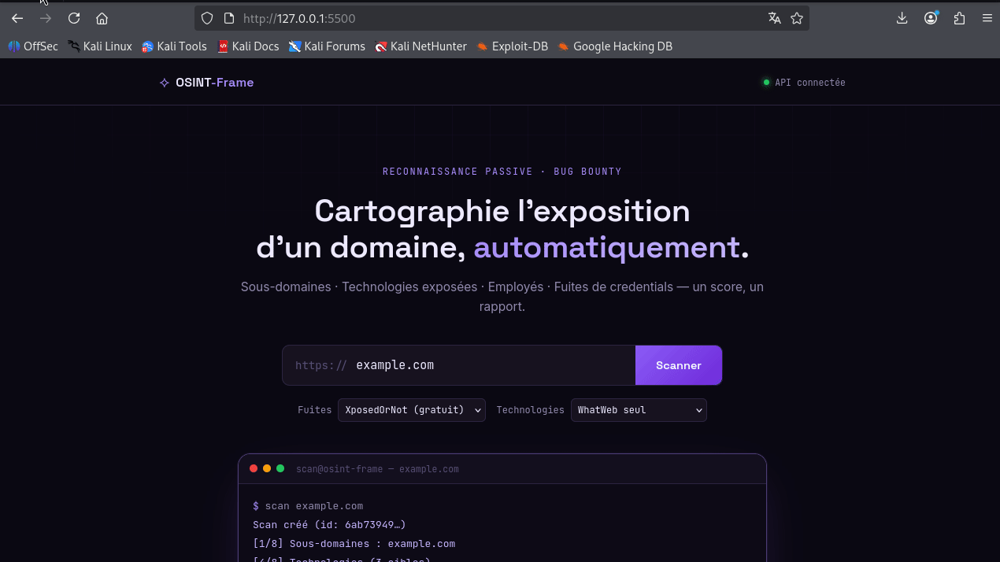

# OSINT-Frame

Framework de reconnaissance passive pour red team et le bug bounty. Prend un nom de
domaine en entrée, cartographie sa surface d'exposition externe à partir
de sources publiques, **interprète** les résultats (candidats au
takeover, environnements hors-prod, surface de phishing), calcule un
score d'exposition et produit un rapport PDF prêt à livrer.



> **Reconnaissance passive uniquement.** Cet outil n'effectue aucune
> tentative d'exploitation, d'intrusion ou de revendication de ressource
> (pas de création de bucket/app pour "confirmer" un takeover). Lis la
> section [Cadre légal](#cadre-légal) avant toute utilisation.

---

## Ce que fait l'outil

| Étape | Sources | Résultat |
|---|---|---|
| Sous-domaines | Sublist3r + crt.sh (transparence des certificats) | Liste dédupliquée, validée par résolution DNS |
| Subdomain takeover | Résolution DNS + fingerprint HTTP (~20 services) | Candidats au takeover — détection passive uniquement |
| Environnements hors-prod | Classification par mot-clé sur le nom | Dev/staging/UAT + panneaux d'administration exposés |
| Technologies | WhatWeb + détecteur d'empreintes intégré | Serveurs, CMS, frameworks, CDN, versions exposées |
| Employés / emails | Hunter.io (prioritaire) ou theHarvester (repli) | Adresses email, noms, poste, niveau de confiance |
| Fuites de credentials | XposedOrNot (gratuit), LeakCheck ou HIBP | Statut compromis par email, sources de fuite |
| Surface de phishing | Requêtes DNS TXT (SPF, DMARC, DKIM) | Risque de spoofing/usurpation de domaine |
| Scoring | — | Score /100 pondéré sur 7 catégories, bande Low/Medium/High/Critical |
| Rapport | — | PDF complet avec résumé exécutif et recommandations |

**Les mots de passe ne sont jamais affichés, journalisés ni stockés en
clair**, à aucune étape — même quand une API en retourne.

**Chaque résultat porte un niveau de confiance explicite** plutôt qu'une
affirmation catégorique : un candidat takeover reste un "candidat", un
DKIM non trouvé reste "non trouvé" (jamais "absent"), un environnement
hors-prod détecté par mot-clé reste une hypothèse à vérifier. C'est
délibéré — voir chaque module pour le détail de son raisonnement.

---

## Installation

### Prérequis système (Kali Linux)

```bash
# Outils de reconnaissance
sudo apt update
sudo apt install -y sublist3r theharvester whatweb

# Dépendances de rendu PDF (WeasyPrint)
sudo apt install -y libpango-1.0-0 libpangocairo-1.0-0 \
    libgdk-pixbuf2.0-0 libcairo2 libffi-dev
```

L'absence d'un de ces outils n'empêche pas le démarrage : le scan
continue avec des résultats partiels, et l'API le signale au lancement
ainsi que dans `GET /health`.

### Dépendances Python

```bash
python3 -m venv venv
source venv/bin/activate
pip install -r backend/requirements.txt
```

### Configuration (optionnelle)

Le framework fonctionne **sans aucune clé API** : le provider de fuites
par défaut (XposedOrNot) est gratuit et ne nécessite pas d'inscription.

Pour aller plus loin (notamment **Hunter.io**, fortement recommandé —
voir [Limites connues](#limites-connues) sur theHarvester) :

```bash
cp config/api_keys.yaml.example config/api_keys.yaml
# puis édite config/api_keys.yaml
```

Une variable d'environnement du même nom écrase toujours la valeur du
fichier :

```bash
export HUNTER_API_KEY="..."      # priorité sur hunter_api_key du YAML
export LEAKCHECK_API_KEY="..."   # idem pour leakcheck_api_key
```

Vérifier la configuration résolue (les clés sont masquées à l'affichage) :

```bash
python backend/config_loader.py
```

`config/api_keys.yaml` est dans `.gitignore` et ne doit jamais être commité.

---

## Utilisation

### Interface web

```bash
# Terminal 1 — backend
cd backend
uvicorn app:app --reload

# Terminal 2 — frontend
cd frontend
python3 -m http.server 5500
```

Ouvre `http://127.0.0.1:5500`.

### Ligne de commande

```bash
# Pipeline complet (8 étapes, voir Architecture)
python backend/run_pipeline.py exemple.com --out result.json

# Rapport PDF depuis un résultat
python backend/report/pdf_generator.py --input result.json --out rapport.pdf

# Modules individuels
python backend/core/subdomain_scanner.py exemple.com --json
python backend/core/takeover_detector.py exemple.com sub1.exemple.com sub2.exemple.com --json
python backend/core/environment_classifier.py admin.exemple.com staging.exemple.com --json
python backend/core/tech_detector.py www.exemple.com --json
python backend/core/employee_finder.py exemple.com --json
python backend/core/leak_checker.py contact@exemple.com --json
python backend/core/email_security.py exemple.com --json
```

### Test de bout en bout

```bash
# Avec l'API démarrée dans un autre terminal
python backend/smoke_test.py exemple.com
```

---

## API

Documentation interactive : `http://127.0.0.1:8000/docs`

| Méthode | Route | Description |
|---|---|---|
| `GET` | `/health` | Outils détectés, réglages actifs, clés configurées (booléens) |
| `POST` | `/scan` | Démarre un scan (202 + id, exécution en arrière-plan) |
| `GET` | `/scan/{id}/status` | Statut et progression |
| `GET` | `/scan/{id}/results` | Résultat complet (JSON) |
| `GET` | `/scan/{id}/report` | Rapport PDF (généré à la demande, mis en cache) |
| `GET` | `/scans` | Historique paginé (`limit`, `offset`, `domain`) |
| `DELETE` | `/scan/{id}` | Supprime un scan et son PDF |

---

## Architecture

```
osint-framework/
├── backend/
│   ├── app.py                       API FastAPI
│   ├── run_pipeline.py              Orchestration des 8 étapes
│   ├── config_loader.py             Résolution des clés et réglages
│   ├── database.py                  SQLite / SQLAlchemy
│   ├── smoke_test.py                Test end-to-end
│   ├── requirements.txt
│   ├── core/
│   │   ├── subdomain_scanner.py     Sublist3r + crt.sh + DNS
│   │   ├── takeover_detector.py     Candidats au subdomain takeover
│   │   ├── environment_classifier.py Hors-prod / panneaux admin
│   │   ├── tech_detector.py         WhatWeb + détecteur lite
│   │   ├── employee_finder.py       Hunter.io + repli theHarvester
│   │   ├── leak_checker.py          XposedOrNot / LeakCheck / HIBP
│   │   ├── email_security.py        SPF / DKIM / DMARC
│   │   └── scoring_engine.py        Grille pondérée à 7 catégories
│   ├── models/scan_result.py        Modèle Pydantic commun
│   └── report/
│       ├── pdf_generator.py
│       └── template.html
├── frontend/
│   ├── index.html
│   ├── css/style.css
│   └── js/{api.js,main.js}
└── config/
    └── api_keys.yaml.example
```

Le pipeline complet (`run_pipeline.py`) exécute, dans l'ordre :
**[1]** sous-domaines → **[2]** subdomain takeover → **[3]** environnements
hors-prod → **[4]** technologies → **[5]** employés/emails → **[6]** fuites
de credentials → **[7]** surface de phishing → **[8]** scoring.

Chaque module `core/` reste autonome et testable en CLI indépendamment
du pipeline. Tous alimentent le même modèle `ScanResult`, consommé
ensuite par le scoring puis le PDF.

---

## Grille de scoring

| Catégorie | Poids | Signal |
|---|---|---|
| Fuites de credentials | 22 % | Plancher à 60/100 dès la première fuite confirmée |
| Subdomain takeover | 22 % | CNAME orphelin ou fingerprint confirmé — signal quasi-certain |
| Technologies | 13 % | Versions divulguées, versions obsolètes |
| Surface de phishing (SPF/DKIM/DMARC) | 13 % | DMARC pèse le plus (55 %), SPF (35 %), DKIM en complément (10 %) |
| Environnements hors-prod / panneaux admin | 12 % | Heuristique sur le nom — panneaux admin pèsent plus que le hors-prod générique |
| Surface d'attaque | 9 % | Nombre de sous-domaines actifs |
| Employés exposés | 9 % | Volume d'emails identifiés, pondéré par confiance (high/medium/low) |

Le score reflète une **exposition observable**, pas une vulnérabilité
confirmée ni une preuve d'exploitabilité.

**Ce score est qualitatif, volontairement pas du CVSS.** Le CVSS/EPSS a
du sens *par vulnérabilité individuelle*, pas comme moyenne agrégée au
niveau d'un domaine — additionner des CVSS de nature différente n'a pas
de fondement méthodologique et donnerait une fausse impression de
rigueur. C'est un choix assumé plutôt qu'une limite technique (voir
`scoring_engine.py` pour le raisonnement complet).

**Fuites et takeover pèsent le plus lourd** car ce sont les deux seules
catégories où l'exposition est quasi-confirmée plutôt que potentielle —
un CNAME orphelin ou un email dans une fuite connue *est* le problème,
contrairement à "cette techno a peut-être une CVE" ou "ce sous-domaine
existe". Chaque fois qu'une catégorie a été ajoutée, les poids existants
ont été réduits **proportionnellement** (jamais retirés au hasard) pour
lui faire de la place — voir l'historique des rééquilibrages en tête de
`scoring_engine.py`.

La détection d'obsolescence technologique s'appuie sur une table de
seuils volontairement courte (`OUTDATED_THRESHOLDS` dans
`scoring_engine.py`). Pour un usage sérieux en production, la brancher
sur un flux réel type [endoflife.date](https://endoflife.date) ou une
base CVE (voir [Pistes d'évolution](#pistes-dévolution)).

---

## Limites connues

- **theHarvester renvoie souvent 0 email.** Google et Bing bloquent
  activement le scraping automatisé — certains moteurs (`bing`, `google`)
  ont même été retirés des versions récentes de theHarvester. Une clé
  **Hunter.io** (gratuite jusqu'à 25 requêtes/mois, voir Configuration)
  est utilisée en priorité et donne des résultats nettement plus fiables ;
  theHarvester ne sert plus que de repli.
- **Subdomain takeover et environnements hors-prod sont des heuristiques,
  pas des confirmations.** Le takeover est fondé sur un CNAME orphelin ou
  un fingerprint HTTP (assez fiable), mais la classification hors-prod
  n'est qu'un mot-clé dans le nom (`staging.`, `admin.`...) — le nom seul
  ne garantit rien. Une vérification manuelle reste nécessaire avant tout
  signalement, dans les deux cas.
- **Gros domaines.** Sur un domaine avec des milliers de sous-domaines,
  l'analyse de technologies (`max_tech_targets`, 40 par défaut) et de
  takeover (`max_takeover_targets`, 150 par défaut) sont plafonnées pour
  éviter de saturer la machine. Les sous-domaines au-delà restent listés
  dans le rapport, seules ces deux analyses sont limitées.
- **crt.sh** est régulièrement lent ou indisponible ; le timeout est fixé
  à 30 s et un échec n'interrompt pas le scan.
- **Scans séquentiels.** Les étapes s'exécutent l'une après l'autre.
  Passer à Celery + Redis serait le prochain palier pour du multi-scan
  concurrent.
- **CORS ouvert** (`allow_origins=["*"]`) : configuration de développement.
  À restreindre à une origine précise avant tout déploiement.
- **Aucune authentification** sur l'API. Ne l'expose pas sur un réseau non
  fiable en l'état.

---

## Cadre légal

**N'utilise cet outil que sur des domaines pour lesquels tu disposes d'une
autorisation explicite.**

Cela signifie concrètement :

- Un programme de bug bounty dont le **scope écrit** couvre le domaine visé
  (vérifie aussi que la reconnaissance automatisée est autorisée : certains
  programmes l'interdisent ou imposent des limites de débit) ;
- Un mandat d'audit signé avec le propriétaire des actifs ;
- Tes propres domaines et infrastructures.

Même en reconnaissance purement passive, plusieurs points méritent
attention :

- **Les données personnelles collectées** (noms, emails, postes
  d'employés) relèvent du RGPD en Europe. Leur collecte doit avoir une
  base légale, leur conservation être limitée dans le temps, et leur
  traitement documenté. L'endpoint `DELETE /scan/{id}` existe précisément
  pour purger ces données une fois le rapport livré.
- **Les résultats de fuites de credentials** sont particulièrement
  sensibles. Ne les diffuse qu'au propriétaire légitime des comptes
  concernés, par un canal sécurisé.
- **Les candidats au subdomain takeover ne doivent jamais être revendiqués**
  (créer le bucket/app/service manquant) sans autorisation explicite —
  ce serait une prise de contrôle réelle, plus de la reconnaissance passive.
- **Les conditions d'utilisation des API tierces** (LeakCheck, HIBP,
  XposedOrNot, Hunter.io) s'appliquent : respecte leurs limites de débit et
  leurs restrictions d'usage commercial.
- **La reconnaissance passive reste de la reconnaissance.** Selon la
  juridiction, une collecte massive et systématique d'informations sur une
  organisation sans autorisation peut être qualifiée d'acte préparatoire.
  L'absence d'exploitation ne constitue pas une immunité.

L'auteur et les contributeurs de cet outil déclinent toute responsabilité
en cas d'usage non autorisé. La responsabilité de vérifier le cadre légal
applicable incombe entièrement à l'utilisateur.

---

## Pistes d'évolution

- **Corrélation version → CVE (NVD)**, avec score CVSS/EPSS affiché *par
  vulnérabilité individuelle* (jamais agrégé dans le score global — voir
  [Grille de scoring](#grille-de-scoring)). Volontairement reportée : le
  matching version→CPE→CVE à partir de bannières HTTP est un aimant à
  faux positifs si le filtrage n'est pas fait sérieusement.
- Scans périodiques avec comparaison de deltas entre deux exécutions
  (nouveau sous-domaine, DMARC qui régresse, etc.) — transforme l'outil
  d'un one-shot en suivi continu.
- Enrichissement Shodan (services déjà indexés, sans scan actif).
- Recherche de secrets dans les dépôts GitHub publics de l'organisation
  (`gitleaks`/`trufflehog`).
- Mode actif optionnel (Nmap, nuclei), strictement séparé et confirmé
  explicitement dans l'interface — hors scope de la reconnaissance passive
  actuelle.
